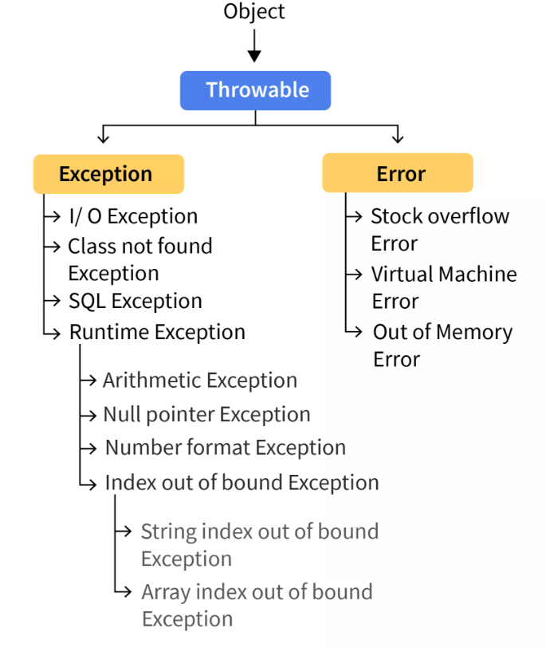

# 🔹 **Exception Handling in Java**

## 🔹 **Definition**
**Exception Handling** is a mechanism in Java that allows a program to **handle runtime errors** and **continue execution** instead of abruptly terminating. It is used to **detect, handle, and recover from unexpected events (exceptions) at runtime.**

---

---

## 🔹 **Syntax**
```java
try {
    // Code that may throw an exception
} catch (ExceptionType e) {
    // Handling exception
} finally {
    // Code that will always execute (optional)
}
```

---

## 🔹 **Working Mechanism**
1. **`try` block** – Contains code that might generate an exception.
2. **`catch` block** – Handles the exception if one occurs.
3. **`finally` block (optional)** – Executes **always**, whether an exception occurs or not.
4. **`throw` keyword** – Used to **manually throw an exception**.
5. **`throws` keyword** – Declares exceptions in method signatures.

---

## 🔹 **Key Features & Properties**
✔ **Prevents abrupt termination**  
✔ **Maintains normal program flow**  
✔ **Catches multiple exceptions** using multiple `catch` blocks  
✔ **Supports custom exceptions** (`extends Exception`)  
✔ **Can propagate exceptions** using `throws`

---

## 🔹 **Code Example**
```java
public class ExceptionExample {
    public static void main(String[] args) {
        try {
            int result = 10 / 0;  // This will cause ArithmeticException
            System.out.println(result);
        } catch (ArithmeticException e) {
            System.out.println("Error: Division by zero is not allowed.");
        } finally {
            System.out.println("Execution completed.");
        }
    }
}
```
**📝 Output:**
```
Error: Division by zero is not allowed.
Execution completed.
```

---

## 🔹 **Use Cases & Applications**
✅ **Preventing unexpected crashes**  
✅ **Handling invalid user inputs**  
✅ **Managing file I/O operations**  
✅ **Ensuring database connectivity stability**  
✅ **Implementing retry logic in applications**

---

## 🔹 **Comparison Table: Checked vs Unchecked Exceptions**

| Feature           | Checked Exception (`Exception`) | Unchecked Exception (`RuntimeException`) |
|------------------|--------------------------------|----------------------------------------|
| **When occurs?** | Compile-time                 | Runtime                              |
| **Requires handling?** | Yes (`try-catch` or `throws`) | No (but recommended)                  |
| **Examples**     | `IOException`, `SQLException` | `NullPointerException`, `ArithmeticException` |
| **Must be declared in method signature?** | ✅ Yes | ❌ No |

---

## 🔹 **Common Mistakes & Best Practices**
❌ **Mistake:** Catching `Exception` instead of specific types
```java
catch (Exception e) { // ❌ Bad practice
    System.out.println("An error occurred.");
}
```
✅ **Best Practice:** Catch only necessary exceptions
```java
catch (ArithmeticException e) { // ✅ Good practice
    System.out.println("Cannot divide by zero.");
}
```
---


## 🔹 **Interview Questions & Answers**
🔹 **Q1:** What is the difference between `throw` and `throws`?  
✅ **A:**
- `throw` is used to **manually throw an exception** inside a method.
- `throws` is used in a method signature to **declare exceptions** that the method might throw.

🔹 **Q2:** What happens if an exception is not caught?  
✅ **A:** The JVM **terminates the program** and prints a stack trace.

🔹 **Q3:** Can a `finally` block have a return statement?  
✅ **A:** Yes, but it **overrides** any return value from `try` or `catch`.

---

## 🔹 **Memory Trick / Mnemonic**
🔹 **"Try Catch Finally Saves Code from Crashing!"**  
🔹 `try` → **Tries risky code**  
🔹 `catch` → **Catches errors**  
🔹 `finally` → **Executes always**

---

Let me know if you want an in-depth explanation of **specific exception types or advanced concepts! 🚀**


## **Checked vs Unchecked Exceptions in Java**

| Feature                 | **Checked Exception (`extends Exception`)** | **Unchecked Exception (`extends RuntimeException`)** |
|-------------------------|--------------------------------------------|----------------------------------------------|
| **Definition**          | Exceptions that are **checked at compile-time**. | Exceptions that occur **at runtime** and are not checked at compile-time. |
| **Requires `throws` keyword** | Yes, must be declared using `throws`. | No, can be handled but not mandatory. |
| **Needs `try-catch` block** | Yes, must be handled using `try-catch`. | No, but can be handled if needed. |
| **Type of error**       | **External issues** (e.g., file not found, database connection failure). | **Programming logic errors** (e.g., null pointer, division by zero). |
| **Examples**           | `IOException`, `SQLException`, `ClassNotFoundException`. | `NullPointerException`, `ArithmeticException`, `ArrayIndexOutOfBoundsException`. |
| **Handling approach**   | Must be explicitly handled by the programmer. | The programmer should fix the code logic to avoid these exceptions. |
| **Execution impact**    | Application **must handle** these exceptions to run smoothly. | Occurs due to **coding mistakes**, can crash the program if not handled. |
| **Extends**            | `Exception` class. | `RuntimeException` class. |
| **Best suited for**    | Handling external factors beyond the program's control. | Handling logical errors in the program. |

This comparison clearly differentiates **Checked vs Unchecked Exceptions** in Java. Let me know if you need more details!